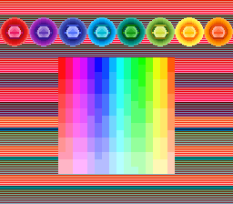
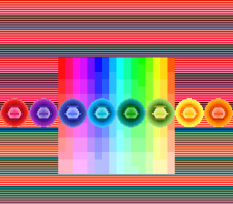

# snes-colors

A small SNES tech demo to test how many colors can a stock console display at once in mode 1.

425 colors 

422 colors 

BG1: 224 colors 
BG2: 90 colors 
Sprites: 120 colors 

Every frame shows more than 400 unique colors. 
Room for improvement: 
- 2 of the background palettes are not used
- The BG1 colors count could be increased further more with f-blank

[Download ROM colors.sfc](https://github.com/Krokodyl/snes-colors/raw/refs/heads/master/colors.sfc)

